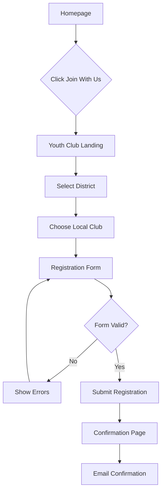
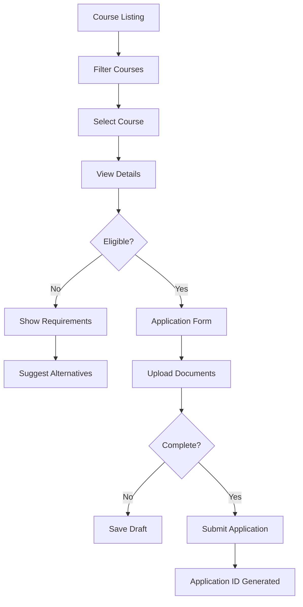
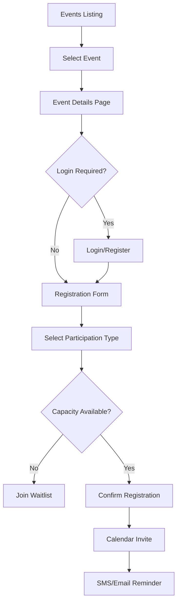

# NYSC Website UI/UX Specification

## Introduction

This document defines the user experience goals, information architecture, user flows, and visual design specifications for NYSC Website's user interface. It serves as the foundation for visual design and frontend development, ensuring a cohesive and user-centered experience.

### Overall UX Goals & Principles

#### Target User Personas

1. **Sri Lankan Youth (Primary):** Young people aged 15-29 seeking programs, training, and opportunities for personal and professional development
2. **Youth Club Members:** Active participants in youth clubs across 25 districts who need access to resources, events, and community features  
3. **Program Administrators:** NYSC staff managing programs, content, and user registrations
4. **General Public:** Parents, educators, and community members seeking information about NYSC services

#### Usability Goals

- **Multilingual Accessibility:** Users can seamlessly switch between Sinhala, Tamil, and English with complete content parity
- **Mobile-First Experience:** Core features accessible on mobile devices (50%+ of youth access via mobile)
- **Quick Task Completion:** Users can find programs, register, or access resources within 3 clicks
- **Clear Information Hierarchy:** Content organized to match user mental models (Programs → Services → Resources)

#### Design Principles

1. **Cultural Sensitivity First** - Respect Sri Lankan cultural context in imagery, colors, and content presentation
2. **Progressive Disclosure** - Show overview information first, detailed content on demand
3. **Visual Hierarchy Through Color** - Use NYSC brand colors (teal #1aa79e, orange #f38621) to guide attention
4. **Accessibility by Default** - WCAG 2.1 AA compliance with focus on multilingual support
5. **Performance-Conscious Design** - Optimize for slower connections common in rural areas

### Change Log

| Date | Version | Description | Author |
|------|---------|-------------|--------|
| 2024-01-22 | 1.0 | Initial specification created | UX Expert |

## Information Architecture (IA)

### Site Map / Screen Inventory

```mermaid
graph TD
    A[Homepage] --> B[About NYSC]
    A --> C[Programs]
    A --> D[Services]
    A --> E[News & Events]
    A --> F[Resources]
    A --> G[Contact]
    
    B --> B1[Leadership]
    B --> B2[Our History]
    B --> B3[Mission & Vision]
    
    C --> C1[Youth Awards]
    C --> C2[Skill Development]
    C --> C3[Cultural Programs]
    C --> C4[Youth Parliament]
    C --> C5[Find Courses]
    
    D --> D1[Youth Clubs]
    D --> D2[Sports Development]
    D --> D3[Education & Training]
    D --> D4[International Relations]
    D --> D5[Career Guidance]
    D --> D6[Volunteer Programs]
    
    E --> E1[Latest News]
    E --> E2[Events Calendar]
    E --> E3[Achievements]
    E --> E4[Photo Gallery]
    
    F --> F1[Downloads]
    F --> F2[Student Portal]
    F --> F3[Annual Reports]
    
    G --> G1[District Offices]
    G --> G2[Training Centers]
    G --> G3[Youth Centers]
    G --> G4[Contact Form]
```

### Navigation Structure

**Primary Navigation:** Horizontal top navigation bar with 7 main sections (About, Programs, Services, News & Events, Resources, Contact, Language Selector). Includes search functionality and theme toggle. Sticky on scroll for desktop, hamburger menu for mobile.

**Secondary Navigation:** Dropdown menus for each primary nav item showing subsections. Footer contains quick links to popular sections, organized by category (Programs, Resources, Contact Info).

**Breadcrumb Strategy:** Show on all interior pages following pattern: Home > Section > Subsection > Current Page. Bilingual breadcrumbs matching selected language. Hidden on mobile to save space.

## User Flows

### Flow 1: Youth Club Registration

**User Goal:** Join or register with a local youth club

**Entry Points:** 
- Homepage "Join With Us" CTA button
- Services > Youth Clubs navigation
- Youth Club service card in ServicesSection component

**Success Criteria:** User successfully submits registration with their district youth club selection

#### Flow Diagram

#### Edge Cases & Error Handling:
- No clubs available in selected district → Show nearest alternatives
- Form validation errors → Inline error messages in user's selected language
- Network failure → Save form data locally, retry submission
- Duplicate registration → Show member login option

**Notes:** Multi-language form validation needed. Consider SMS confirmation for users without email.

### Flow 2: Course Enrollment

**User Goal:** Find and apply for vocational training courses

**Entry Points:**
- PopularCourses section "Apply Now" buttons
- Programs > Find Courses navigation
- Homepage quick links

**Success Criteria:** User finds suitable course and completes application

#### Flow Diagram

#### Edge Cases & Error Handling:
- Course full → Add to waitlist option
- Missing prerequisites → Show pathway to eligibility
- Document upload fails → Alternative submission methods
- Age/location restrictions → Clear messaging with alternatives

**Notes:** PopularCourses component already shows 6 courses with categories. Need backend integration for real-time availability.

### Flow 3: Event Registration

**User Goal:** Register for NYSC events and programs

**Entry Points:**
- NewsEventsSection component
- News & Events > Events navigation
- Email newsletter links

**Success Criteria:** User successfully registers and receives event details

#### Flow Diagram

#### Edge Cases & Error Handling:
- Event cancelled → Notify registered users immediately
- Capacity reached → Waitlist with automatic promotion
- Multiple registrations → Prevent duplicates, allow group registration
- Location changes → Push notifications to registered attendees

**Notes:** NewsEventsSection shows upcoming events. Integration with calendar apps would improve user experience.

## Wireframes & Mockups

### Design Files

**Primary Design Files:** [To be created in Figma - Link pending]

### Key Screen Layouts

#### Homepage

**Purpose:** Primary entry point showcasing NYSC's mission, key services, and driving users to relevant programs

**Key Elements:**
- Hero section with animated background (HeroParticleMesh) and main CTA
- Floating KeyServiceAreas cards (Sports, Aesthetics, Education, Administration)
- YouthOfferings grid with 6 program categories
- Organizations showcase (Youth Club, Youth Services Limited, NYSCO)
- Leaders section with ministerial team
- PopularCourses carousel with 6 featured courses
- ServicesSection with interactive service tiles
- TestimonialsSection with member stories
- NewsEventsSection with latest updates
- Newsletter signup in footer

**Interaction Notes:** Smooth scroll between sections, hover effects on cards scale to 105%, parallax effect on hero background, lazy loading for images

**Design File Reference:** [Homepage - Desktop/Mobile/Tablet views]

#### Youth Club Registration

**Purpose:** Facilitate youth club membership registration with district selection

**Key Elements:**
- Progress indicator (Step 1: District, Step 2: Club, Step 3: Details, Step 4: Confirm)
- Interactive Sri Lanka district map for selection
- Club listing cards with member count and activities
- Multi-step form with validation
- Language toggle maintained throughout flow
- Success confirmation with member ID generation

**Interaction Notes:** Form auto-saves progress, district selection updates club list dynamically, real-time validation with inline errors

**Design File Reference:** [Registration Flow - All steps]

#### Course Catalog

**Purpose:** Browse and filter vocational training courses across all NYSC centers

**Key Elements:**
- Filter sidebar (Category, Duration, Location, Schedule type)
- Course cards matching PopularCourses component design
- Search bar with auto-complete
- Sort options (Popularity, Start date, Duration)
- Course detail modal/page with curriculum outline
- Apply button with eligibility checker
- Related courses recommendation

**Interaction Notes:** Filters apply instantly, course cards flip to show details on hover (desktop), sticky filter bar on mobile scroll

**Design File Reference:** [Course Catalog - Grid and Detail views]

#### News & Events Hub

**Purpose:** Central location for NYSC news, announcements, and event registrations

**Key Elements:**
- Featured article hero banner
- News grid with category badges (Sport, Achievement, Cultural, etc.)
- Events calendar widget showing upcoming 30 days
- Filter tabs (All, News, Events, Achievements)
- Share functionality for social media
- Newsletter subscription prompt
- Load more pagination

**Interaction Notes:** Infinite scroll on mobile, hover preview on news cards, calendar date selection shows events

**Design File Reference:** [News Hub - List and Article views]

#### Admin Dashboard

**Purpose:** Backend interface for NYSC staff to manage content and registrations

**Key Elements:**
- Statistics overview cards (Active members, Pending applications, Upcoming events)
- Quick actions panel (Add news, Create event, Export reports)
- Recent activity feed
- Multi-language content management interface
- Registration approval queue
- Analytics charts (Member growth, Program enrollment)

**Interaction Notes:** Real-time updates via WebSocket, drag-and-drop for content ordering, bulk actions for approvals

**Design File Reference:** [Admin Dashboard - Main and subpages]

## Component Library / Design System

### Design System Approach

**Design System Approach:** Custom component library built on NYSC brand guidelines with SLDDS (Sri Lanka Digital Design System) compliance, implemented using Tailwind CSS v3.x utility classes with React components. Emphasis on accessibility and trilingual support.

### Core Components

#### Button

**Purpose:** Primary interactive element for CTAs and form actions

**Variants:** Primary (gradient), Secondary (outlined), Ghost (text only), Icon (with/without text)

**States:** Default, Hover (scale-105), Active, Disabled, Loading (with spinner)

**Usage Guidelines:** Primary for main CTAs (1 per viewport), Secondary for supporting actions, Ghost for tertiary actions. Minimum touch target 44x44px. Include aria-labels for icon-only buttons.

#### Card

**Purpose:** Container for grouped content with optional interactions

**Variants:** Basic (static), Interactive (hover effects), Service (with icon), Course (with image), News (with category badge)

**States:** Default, Hover (shadow elevation), Selected (border highlight), Loading (skeleton)

**Usage Guidelines:** Maintain consistent padding (24px desktop, 16px mobile). Use glassy effect for overlapping hero content. Always include heading hierarchy.

#### Input

**Purpose:** Form field for user data entry

**Variants:** Text, Email, Phone, Textarea, Select dropdown, File upload, Date picker

**States:** Default, Focus (ring), Valid (green border), Error (red border with message), Disabled

**Usage Guidelines:** Always pair with label. Show helper text for complex fields. Inline validation on blur. Group related fields. Support autofill.

#### Modal

**Purpose:** Overlay dialog for focused interactions

**Variants:** Confirmation, Form, Information, Media gallery

**States:** Closed, Opening (fade in), Open, Closing (fade out)

**Usage Guidelines:** Include close button and ESC key handling. Trap focus within modal. Maximum width 600px. Blur background content. Stack multiple modals with z-index management.

#### Navigation

**Purpose:** Primary and secondary navigation components

**Variants:** Desktop horizontal, Mobile hamburger, Dropdown mega-menu, Breadcrumb, Tab navigation

**States:** Default, Active page, Hover, Mobile expanded

**Usage Guidelines:** Sticky header on scroll for desktop. Hamburger menu for mobile <768px. Maintain language selection across navigation. Show current page indicator.

#### LanguageSelector

**Purpose:** Interface for switching between Sinhala, Tamil, and English

**Variants:** Dropdown (desktop), Modal (mobile), Inline flags

**States:** Default, Open, Language switching (loading state)

**Usage Guidelines:** Persist selection in localStorage. Show language name in its own script. Position consistently in header. Include keyboard navigation support.

#### Badge

**Purpose:** Label for categorization and status indication

**Variants:** Category (gradient), Status (solid), NVQ level, Schedule type (Full/Part time)

**States:** Default, Interactive (if clickable)

**Usage Guidelines:** Consistent color mapping per category. Readable contrast ratios. Maximum 20 characters. Include icons where helpful.

#### LoadingSpinner

**Purpose:** Indicate loading or processing states

**Variants:** Inline (small), Page (centered), Button (inside button), Overlay (full screen)

**States:** Spinning (continuous animation)

**Usage Guidelines:** Use for operations >300ms. Include accessible loading text. Maintain aspect ratio. Use brand colors for spinner.

#### SearchBar

**Purpose:** Global search functionality

**Variants:** Header (collapsed/expanded), Page (full width), With filters, With suggestions

**States:** Default, Focus (expanded), Searching, Results shown

**Usage Guidelines:** Minimum 300px width expanded. Show recent searches. Support keyboard navigation in suggestions. Debounce input by 300ms.

#### NewsCard

**Purpose:** Display news article previews

**Variants:** Featured (large), Grid (medium), List (compact)

**States:** Default, Hover (show excerpt), Read (muted appearance)

**Usage Guidelines:** Show read time estimate. Include category badge. Truncate title at 2 lines. Support social sharing. Lazy load images.

## Branding & Style Guide

### Visual Identity

**Brand Guidelines:** NYSC Brand Identity following Sri Lanka government design standards with modern youth-focused adaptations

### Color Palette

| Color Type | Hex Code | Usage |
|------------|----------|--------|
| Primary | #1aa79e | Main brand color - CTAs, headers, active states |
| Secondary | #f38621 | Accent color - highlights, secondary CTAs, badges |
| Accent | Gradient: #1aa79e to #f38621 | Premium CTAs, hero elements, special emphasis |
| Success | #22c55e | Positive feedback, confirmations, success states |
| Warning | #f59e0b | Cautions, important notices, pending states |
| Error | #ef4444 | Errors, destructive actions, validation failures |
| Neutral | Gray scale: #f9fafb to #111827 | Text, borders, backgrounds - adaptive for light/dark themes |

### Typography

#### Font Families
- **Primary:** Noto Sans (Latin), Noto Sans Sinhala (Sinhala), Noto Sans Tamil (Tamil)
- **Secondary:** Inter for UI elements and numbers
- **Monospace:** JetBrains Mono for codes, IDs, and technical content

#### Type Scale

| Element | Size | Weight | Line Height |
|---------|------|--------|-------------|
| H1 | 64px (4rem) | Bold (700) | 1.2 |
| H2 | 48px (3rem) | Bold (700) | 1.3 |
| H3 | 32px (2rem) | Semibold (600) | 1.4 |
| Body | 16px (1rem) | Regular (400) | 1.5 |
| Small | 14px (0.875rem) | Regular (400) | 1.4 |

### Iconography

**Icon Library:** Lucide React icons for consistency with existing implementation, supplemented with custom SVG icons for Sri Lankan cultural elements

**Usage Guidelines:** 
- Maintain 2px stroke width for all icons
- Use currentColor for easy theming
- Minimum size 20x20px for touch targets
- Include descriptive aria-labels
- Pair with text labels for critical actions

### Spacing & Layout

**Grid System:** 12-column grid with 24px gutters on desktop, 16px on tablet, 8px on mobile. Maximum content width 1440px centered.

**Spacing Scale:** Base unit 4px multiplied - 4, 8, 16, 24, 32, 48, 64, 96, 128px. Consistent application using Tailwind spacing utilities.

## Accessibility Requirements

### Compliance Target

**Standard:** WCAG 2.1 Level AA with enhanced focus on multilingual accessibility for Sinhala, Tamil, and English content

### Key Requirements

**Visual:**
- Color contrast ratios: Minimum 4.5:1 for normal text, 3:1 for large text (18px+), 3:1 for UI components
- Focus indicators: 2px solid outline with 2px offset, color contrast 3:1 against background, visible in both light/dark themes
- Text sizing: Base 16px minimum, user scalable up to 200% without horizontal scroll, no text in images

**Interaction:**
- Keyboard navigation: All interactive elements accessible via Tab, logical tab order, skip links, escape key for modals
- Screen reader support: Semantic HTML, ARIA labels in user's selected language, live regions for dynamic content
- Touch targets: Minimum 44x44px, 8px spacing between targets, gesture alternatives for all interactions

**Content:**
- Alternative text: Descriptive alt text in all three languages, empty alt="" for decorative images, complex images use long descriptions
- Heading structure: Single H1 per page, sequential hierarchy (no skipping levels), descriptive headings in user's language
- Form labels: Visible labels for all inputs, placeholder text not used as labels, error messages associated with fields via aria-describedby

### Testing Strategy

**Accessibility Testing:**
- Automated testing with axe-core integrated in development workflow
- Manual keyboard navigation testing for all user flows
- Screen reader testing with NVDA (Windows) and TalkBack (Android)
- Color contrast validation with WebAIM tools
- Multilingual content testing with native speakers
- Mobile accessibility testing on real devices
- Cognitive load assessment for complex forms
- Regular audits with Pa11y CI in deployment pipeline

## Responsiveness Strategy

### Breakpoints

| Breakpoint | Min Width | Max Width | Target Devices |
|------------|-----------|-----------|----------------|
| Mobile | 320px | 480px | Small phones, feature phones common in rural areas |
| Tablet | 481px | 768px | Large phones, small tablets, portrait iPads |
| Desktop | 769px | 1024px | Landscape tablets, small laptops, desktop monitors |
| Wide | 1025px | - | Large desktop monitors, TV displays in youth centers |

### Adaptation Patterns

**Layout Changes:** 
- Mobile: Single column, stacked components, full-width cards
- Tablet: 2-column grid for cards, sidebar navigation collapses
- Desktop: 3-4 column grids, side-by-side content and imagery
- Wide: Maximum content width 1440px, increased whitespace, multi-column text

**Navigation Changes:**
- Mobile: Hamburger menu, bottom tab bar for key actions, search hidden until triggered
- Tablet: Condensed horizontal nav, dropdown menus, persistent search
- Desktop: Full horizontal navigation with mega-menu dropdowns, always visible search
- Wide: Extended navigation with descriptive labels, quick access shortcuts

**Content Priority:**
- Mobile: Critical content first (CTAs, key info), hide decorative elements, lazy load images
- Tablet: Show secondary content, introduce imagery, expand truncated text
- Desktop: Full content display, add supplementary information, show related content
- Wide: Enhanced layouts with additional context, data visualizations, richer media

**Interaction Changes:**
- Mobile: Touch-optimized (swipe, tap), bottom sheet modals, floating action buttons
- Tablet: Mixed touch/cursor, side panels, hover states on capable devices
- Desktop: Full hover interactions, right-click menus, keyboard shortcuts, tooltips
- Wide: Advanced interactions, multi-panel layouts, drag-and-drop functionality

## Animation & Micro-interactions

### Motion Principles

1. **Purpose-Driven** - Every animation must enhance understanding or provide feedback, not just decorate
2. **Performance-First** - Use CSS transforms/opacity over layout properties, respect prefers-reduced-motion
3. **Cultural Sensitivity** - Subtle, professional animations appropriate for government-affiliated service
4. **Consistent Timing** - 200ms for micro-interactions, 300ms for transitions, 500ms for complex animations
5. **Natural Easing** - Use ease-out for entrances, ease-in for exits, ease-in-out for movements

### Key Animations

- **Page Transitions:** Fade and slide up content sections (Duration: 300ms, Easing: ease-out)
- **Card Hover:** Scale to 105% with shadow elevation (Duration: 200ms, Easing: ease-out)
- **Button Press:** Scale to 95% then back to 100% (Duration: 150ms, Easing: ease-in-out)
- **Loading Spinner:** Continuous rotation with brand gradient (Duration: 1s, Easing: linear)
- **Form Validation:** Shake animation for errors, checkmark draw for success (Duration: 300ms, Easing: ease-out)
- **Dropdown Menus:** Slide down with fade in (Duration: 250ms, Easing: ease-out)
- **Modal Appearance:** Fade in backdrop, scale up modal from 95% (Duration: 300ms, Easing: ease-out)
- **Number Counters:** Count up animation for statistics (Duration: 2s, Easing: ease-out)
- **Scroll Reveal:** Fade up elements as they enter viewport (Duration: 500ms, Easing: ease-out)
- **Hero Particle Mesh:** Continuous floating animation already implemented (Duration: 20s, Easing: linear)

## Performance Considerations

### Performance Goals

- **Page Load:** Initial load < 3s on 3G, < 1s on broadband, Lighthouse score > 90
- **Interaction Response:** User input feedback < 100ms, navigation < 300ms
- **Animation FPS:** Maintain 60fps for all animations, fallback to reduced motion if needed

### Design Strategies

**Performance Strategies:**
- Progressive image loading with blur-up placeholder technique
- Code splitting by route with React.lazy() and Suspense
- Webfont optimization using font-display: swap and subsetting for used characters
- Critical CSS inlining for above-the-fold content
- Service Worker for offline capability and asset caching
- CDN usage for static assets with CloudFlare (as indicated in your setup)
- Lazy loading components below the fold using Intersection Observer
- Preconnect to required origins and DNS prefetch for external resources
- Bundle size monitoring with webpack-bundle-analyzer
- Image optimization using WebP with JPEG fallback

## Next Steps

### Immediate Actions

1. Review this specification with stakeholders for approval
2. Create Figma workspace and begin high-fidelity mockups
3. Set up component library in Storybook for development handoff
4. Conduct accessibility audit of existing components
5. Implement missing translations in LanguageContext
6. Optimize existing images and implement lazy loading

### Design Handoff Checklist

- [x] All user flows documented
- [x] Component inventory complete
- [x] Accessibility requirements defined
- [x] Responsive strategy clear
- [x] Brand guidelines incorporated
- [x] Performance goals established

## Checklist Results

The UI/UX specification has been completed following best practices for the NYSC website project. All major sections have been documented with consideration for:
- Trilingual support (Sinhala, Tamil, English)
- Mobile-first responsive design
- WCAG 2.1 AA accessibility compliance
- Sri Lankan cultural context
- Government service requirements
- Youth audience preferences

The specification provides a comprehensive foundation for moving forward with visual design and frontend development.